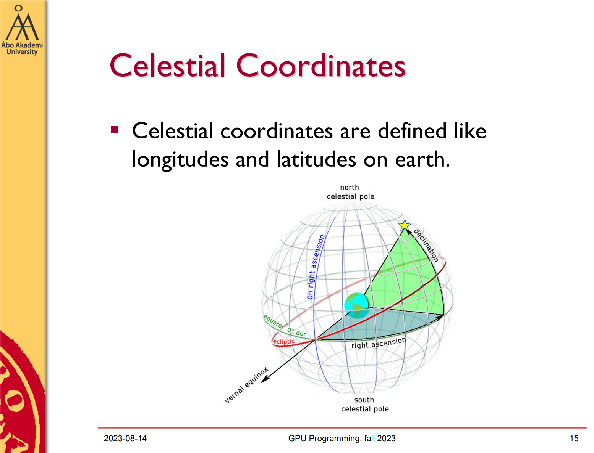
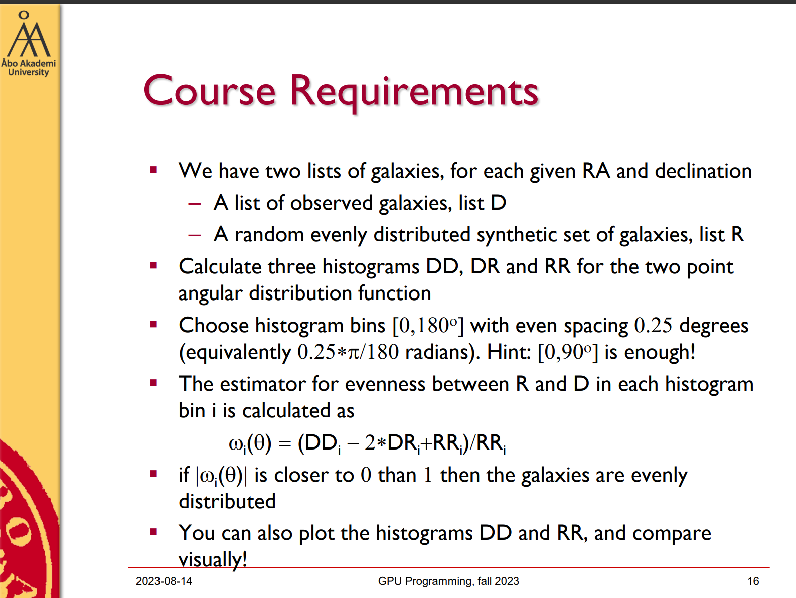
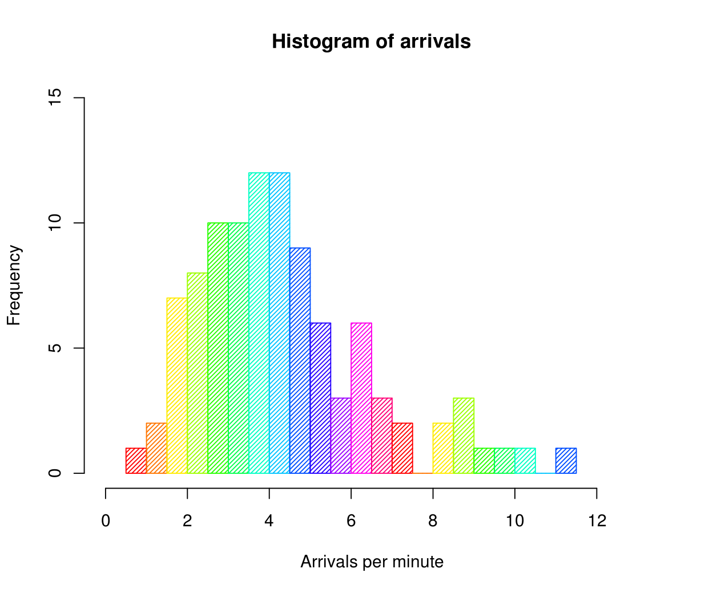
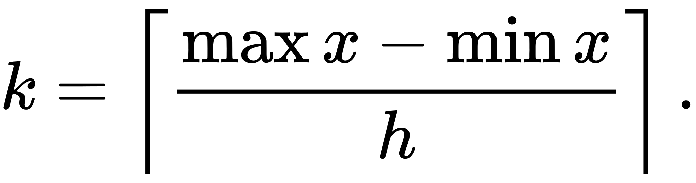
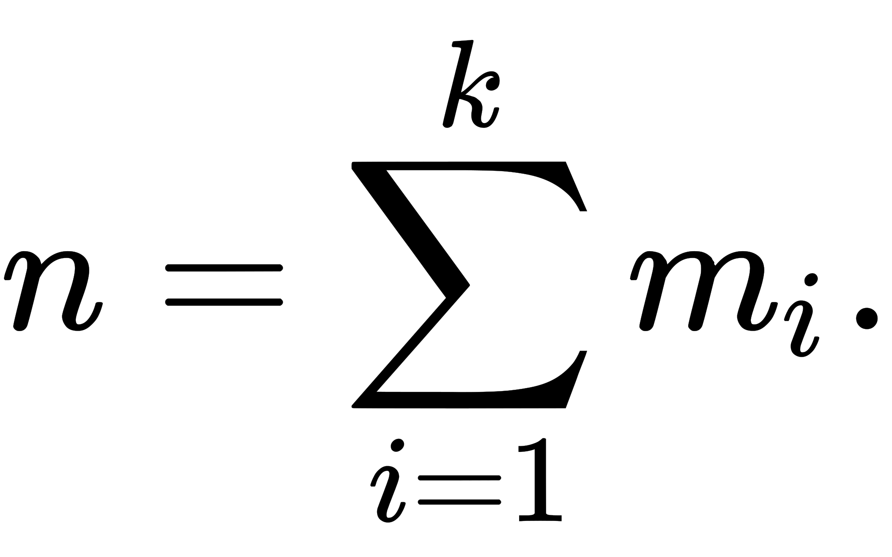
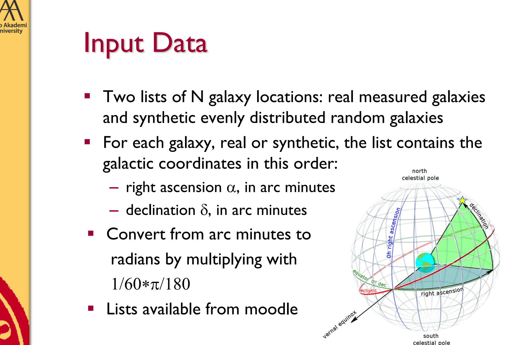
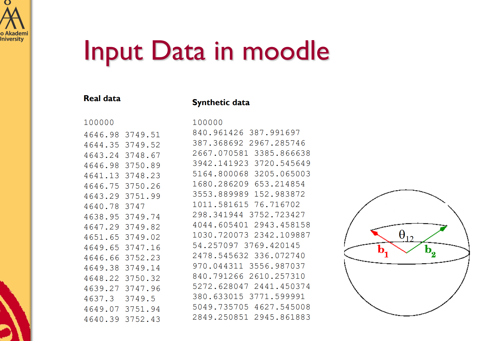
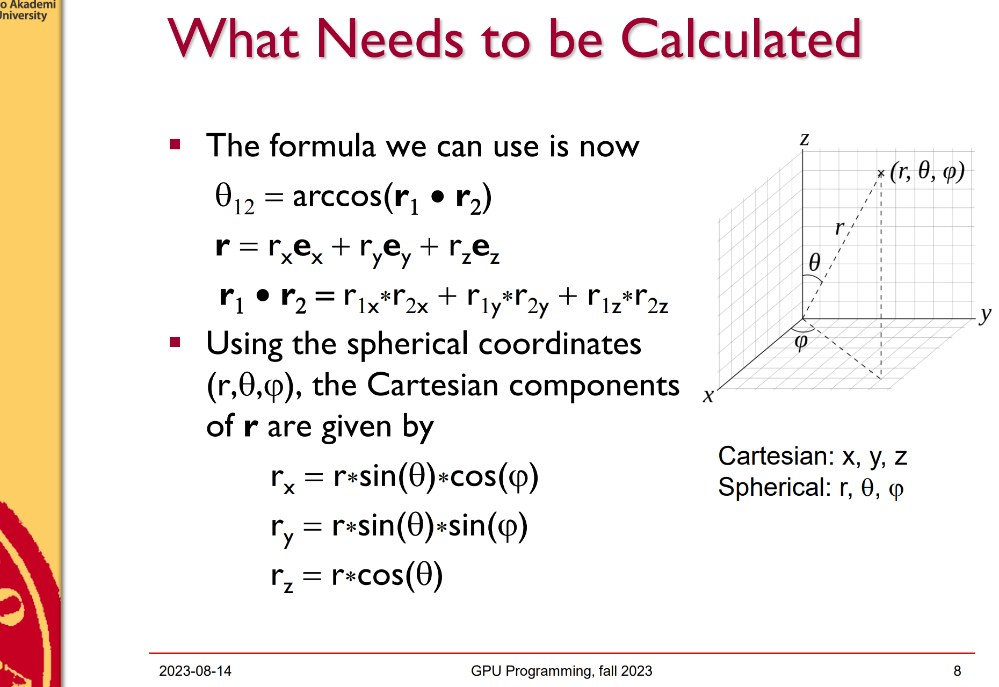
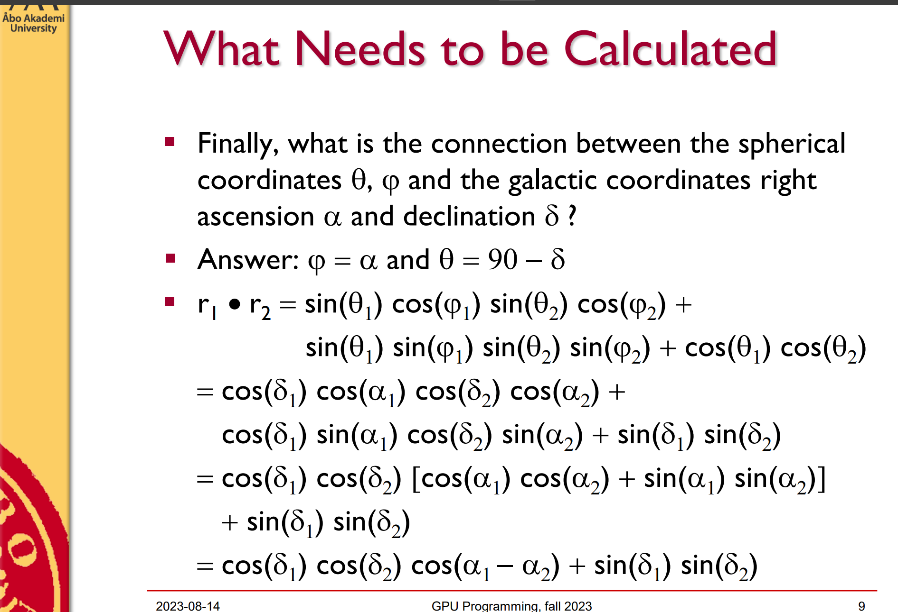
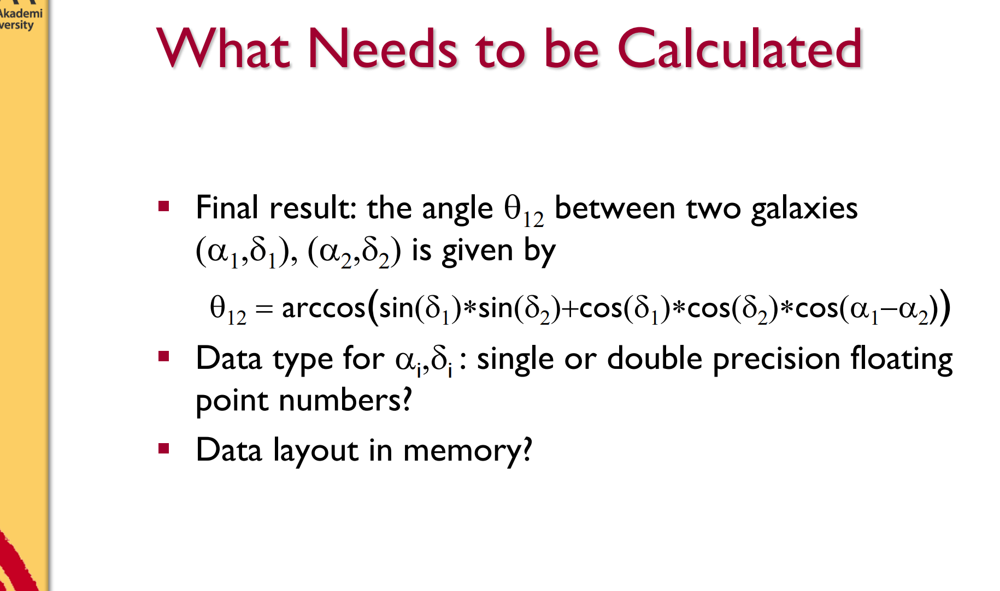

# ÅAU GPU Programming 2023 (IT00CG19-3002)  
  
FYI: I'm just trying to figure out how to solve the problem given from the lectures, here's just my thoughts on it, and I assume **it may not be the correct/only answer**.  

## Background  
The final project is to solve a problem given from the slides using cuda programming. Problem is here:    
    
    
  
Let's try to break this down step by step to understand what should we actually do.  
  
### Histograms DD, DR and RR for the two point angular  
  
First things first, we need 3 histograms ``DD``, ``DR`` and ``RR``.   
### What is a "Histogram"? 
According to [Wikipedia](https://en.wikipedia.org/wiki/Histogram), a **histogram** is a diagram is an approximate representation of the distribution of numerical data, which look like this:  
  
  
Let's say there are 100 entries of data ( in this case integers representing arivals ) in the collection. Each rectengle represents the frequency of data within a range, for example the first rectengle at the right side of 2 on the x/horizontal axis reprecents **the numbers of arrivals between 2 and 2.5 minute**, and all the heights of the rectangles sum up to be 100.  
Here's some terminologies:  
1. The width (on the x/horizontal) of each rectangle is called bin width, marked with ``h`` , then the  number of bins is marked with ``k``:  
  
2.  If we let ``n`` be the total number of observations and ``k`` be the total number of bins, the height of rectangle ``i``  (labled with ``m_i``) meet the following conditions:  
  

#### How to calculate ``DD``, ``RR`` and ``DR``
  
In our case, the rectangle ``DD`` stores frequncies of angles. Each on of theses angle is the angle between 2 vectors, aka 2 different galaxies given the **real measured galaxies** data source. These vectors are given in spherical coordinates, each of them has 2 components, according to the slides: 
  
  
  
And for each 2 of the vectors we can get the cosine of their angle if we divide the **dot product** by **the product of their length**:  
  
  
  
  
Therefore I believe the function probably looks like this:   
```c  
float calculateAngularDistance(float g1_ra, float g1_dec, float g2_ra, float g2_dec) {
    // turning arc minutes to degree
    float ra1 = g1_ra * M_PI / 180.0;
    float dec1 = g1_dec * M_PI / 180.0;
    float ra2 = g2_ra * M_PI / 180.0;
    float dec2 = g2_dec * M_PI / 180.0;

    // calculate angular distance
    float delta_ra = ra2 - ra1;
    float cos_c = sin(dec1) * sin(dec2) + cos(dec1) * cos(dec2) * cos(delta_ra);
    float c = acos(cos_c);
}

__global__ void calculateHistograms(float* d_ra_real, float * d_decl_real, float* r_ra_sim, float* r_decl_sim, int* dd, int* dr, int* rr, int numD, int numR) {
    int index = threadIdx.x + blockIdx.x * blockDim.x;
    int stride = blockDim.x * gridDim.x;

    for (int i = index; i < numD; i += stride) {
        for (int j = i + 1; j < numD; j++) {
            int bin = (int)( calculateAngularDistance(d_ra_real[i], d_decl_real[i], d_ra_real[j], d_decl_real[j]) / 0.25 );
            atomicAdd(&dd[bin], 1);
        }

        for (int j = 0; j < numR; j++) {
            int bin = (int)( calculateAngularDistance(d_ra_real[i], d_decl_real[i], r_ra_sim[j], r_decl_sim[j]) / 0.25 );
            atomicAdd(&dr[bin], 1);
        }
    }

    for (int i = index; i < numR; i += stride) {
        for (int j = i + 1; j < numR; j++) {
            int bin = (int)( calculateAngularDistance(r_ra_sim[i], r_decl_sim[i], r_ra_sim[j], r_decl_sim[j]) / 0.25 );
            atomicAdd(&rr[bin], 1);
        }
    }
}
``` 
  
But the thing is such embedded loop structure may not be optimal because it didn't use the calculated threadID as the index to access the entries in arrays. If we can somehow replace the loops by multi threading it could be better. This bring the following question.  

### Deciding the amount of thread blocks and grid size  
  
This is the device info of dione:  
```
   Found 4 CUDA devices
      Device Tesla V100-PCIE-16GB                  device 0
         compute capability            =        7.0
         totalGlobalMemory             =       16.94 GB
         l2CacheSize                   =    6291456 B
         regsPerBlock                  =      65536
         multiProcessorCount           =         80
         maxThreadsPerMultiprocessor   =       2048
         sharedMemPerBlock             =      49152 B
         warpSize                      =         32
         clockRate                     =    1380.00 MHz
         maxThreadsPerBlock            =       1024
         asyncEngineCount              =          7
         f to lf performance ratio     =          2
         maxGridSize                   =   2147483647 x 65535 x 65535
         maxThreadsDim in thread block =   1024 x 1024 x 64
         concurrentKernels             =        yes
         deviceOverlap                 =          1
            Concurrently copy memory/execute kernel
      Device Tesla V100-PCIE-16GB                  device 1
         compute capability            =        7.0
         totalGlobalMemory             =       16.94 GB
         l2CacheSize                   =    6291456 B
         regsPerBlock                  =      65536
         multiProcessorCount           =         80
         maxThreadsPerMultiprocessor   =       2048
         sharedMemPerBlock             =      49152 B
         warpSize                      =         32
         clockRate                     =    1380.00 MHz
         maxThreadsPerBlock            =       1024
         asyncEngineCount              =          7
         f to lf performance ratio     =          2
         maxGridSize                   =   2147483647 x 65535 x 65535
         maxThreadsDim in thread block =   1024 x 1024 x 64
         concurrentKernels             =        yes
         deviceOverlap                 =          1
            Concurrently copy memory/execute kernel
      Device Tesla V100-PCIE-16GB                  device 2
         compute capability            =        7.0
         totalGlobalMemory             =       16.94 GB
         l2CacheSize                   =    6291456 B
         regsPerBlock                  =      65536
         multiProcessorCount           =         80
         maxThreadsPerMultiprocessor   =       2048
         sharedMemPerBlock             =      49152 B
         warpSize                      =         32
         clockRate                     =    1380.00 MHz
         maxThreadsPerBlock            =       1024
         asyncEngineCount              =          7
         f to lf performance ratio     =          2
         maxGridSize                   =   2147483647 x 65535 x 65535
         maxThreadsDim in thread block =   1024 x 1024 x 64
         concurrentKernels             =        yes
         deviceOverlap                 =          1
            Concurrently copy memory/execute kernel
      Device Tesla V100-PCIE-16GB                  device 3
         compute capability            =        7.0
         totalGlobalMemory             =       16.94 GB
         l2CacheSize                   =    6291456 B
         regsPerBlock                  =      65536
         multiProcessorCount           =         80
         maxThreadsPerMultiprocessor   =       2048
         sharedMemPerBlock             =      49152 B
         warpSize                      =         32
         clockRate                     =    1380.00 MHz
         maxThreadsPerBlock            =       1024
         asyncEngineCount              =          7
         f to lf performance ratio     =          2
         maxGridSize                   =   2147483647 x 65535 x 65535
         maxThreadsDim in thread block =   1024 x 1024 x 64
         concurrentKernels             =        yes
         deviceOverlap                 =          1
            Concurrently copy memory/execute kernel
   Using CUDA device 0

   Assuming input data is given in arc minutes!
   data_100k_arcmin.dat contains 100000 galaxies
   Found 4 CUDA devices
      Device Tesla V100-PCIE-16GB                  device 0
         compute capability            =        7.0
         totalGlobalMemory             =       16.94 GB
         l2CacheSize                   =    6291456 B
         regsPerBlock                  =      65536
         multiProcessorCount           =         80
         maxThreadsPerMultiprocessor   =       2048
         sharedMemPerBlock             =      49152 B
         warpSize                      =         32
         clockRate                     =    1380.00 MHz
         maxThreadsPerBlock            =       1024
         asyncEngineCount              =          7
         f to lf performance ratio     =          2
         maxGridSize                   =   2147483647 x 65535 x 65535
         maxThreadsDim in thread block =   1024 x 1024 x 64
         concurrentKernels             =        yes
         deviceOverlap                 =          1
            Concurrently copy memory/execute kernel
      Device Tesla V100-PCIE-16GB                  device 1
         compute capability            =        7.0
         totalGlobalMemory             =       16.94 GB
         l2CacheSize                   =    6291456 B
         regsPerBlock                  =      65536
         multiProcessorCount           =         80
         maxThreadsPerMultiprocessor   =       2048
         sharedMemPerBlock             =      49152 B
         warpSize                      =         32
         clockRate                     =    1380.00 MHz
         maxThreadsPerBlock            =       1024
         asyncEngineCount              =          7
         f to lf performance ratio     =          2
         maxGridSize                   =   2147483647 x 65535 x 65535
         maxThreadsDim in thread block =   1024 x 1024 x 64
         concurrentKernels             =        yes
         deviceOverlap                 =          1
            Concurrently copy memory/execute kernel
      Device Tesla V100-PCIE-16GB                  device 2
         compute capability            =        7.0
         totalGlobalMemory             =       16.94 GB
         l2CacheSize                   =    6291456 B
         regsPerBlock                  =      65536
         multiProcessorCount           =         80
         maxThreadsPerMultiprocessor   =       2048
         sharedMemPerBlock             =      49152 B
         warpSize                      =         32
         clockRate                     =    1380.00 MHz
         maxThreadsPerBlock            =       1024
         asyncEngineCount              =          7
         f to lf performance ratio     =          2
         maxGridSize                   =   2147483647 x 65535 x 65535
         maxThreadsDim in thread block =   1024 x 1024 x 64
         concurrentKernels             =        yes
         deviceOverlap                 =          1
            Concurrently copy memory/execute kernel
      Device Tesla V100-PCIE-16GB                  device 3
         compute capability            =        7.0
         totalGlobalMemory             =       16.94 GB
         l2CacheSize                   =    6291456 B
         regsPerBlock                  =      65536
         multiProcessorCount           =         80
         maxThreadsPerMultiprocessor   =       2048
         sharedMemPerBlock             =      49152 B
         warpSize                      =         32
         clockRate                     =    1380.00 MHz
         maxThreadsPerBlock            =       1024
         asyncEngineCount              =          7
         f to lf performance ratio     =          2
         maxGridSize                   =   2147483647 x 65535 x 65535
         maxThreadsDim in thread block =   1024 x 1024 x 64
         concurrentKernels             =        yes
         deviceOverlap                 =          1
            Concurrently copy memory/execute kernel
   Using CUDA device 0
```  
  
There are 4 Tesla V100-PCIE-16GB, maximun number of threads per block is 1024, and the shared memory in each thread block is 49152 B (4 MB). 
  
### Normalization and calculating the eveness between R and D   
  


### Visualizing  